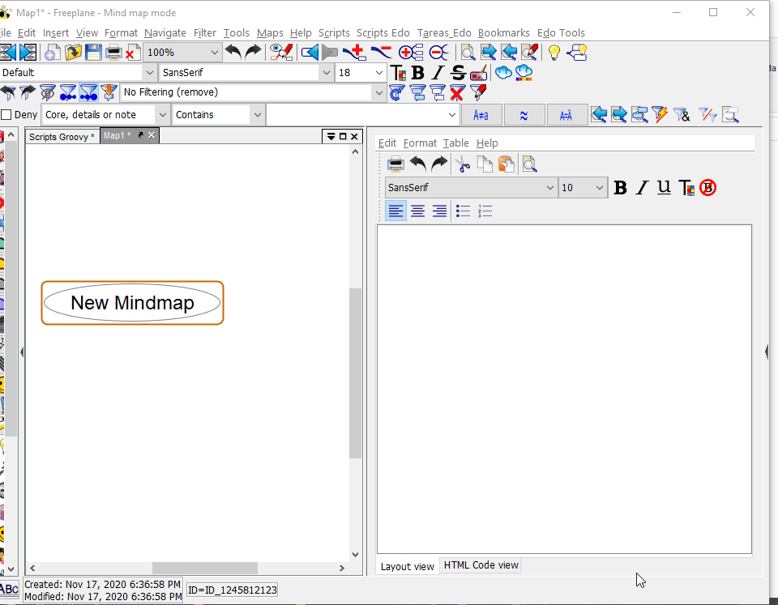

# Freeplane WikdShell_Extension Add On

**WikdShell_Extension** *add_on* for **[Freeplane](https://www.freeplane.org/)** adds some functionalities to the original **[WikdShell](https://www.freeplane.org/wiki/index.php/Add-ons_(install)#wikdShell)** *add_on*.

The original **WikdShell** is a great add_on that gives the user the posibility to open a **Groovy console** directly from **Freeplane** to create, edit and try **scripts** that interact directly with the **mindmaps**.

This way you can **add functionalities** to Freeplane, **automatize** repetitive **tasks** and **improve** your **productivity** when using mindmaps.

The present AddOn (**WikdShell_Extension**) gives you the additional possibility to **"save" the scripts** you create **as nodes in your maps**.

This way you can save all little tests, one time scripts or map specific scripts in your own organized way, **without overflowing** your scripts folders or **Freeplane's scripts submenu**.

> [!IMPORTANT]
> for this script to work, you need the **wikdShell Addon v0.3.2** and a **Freeplane** version equal or newer than **v1.8.10-pre06** or the stable version **v1.8.10**

## Install

1. Get the last version from **Freeplane** from [here](https://sourceforge.net/projects/freeplane/) and install it
1. Download the last version of **WikdShell AddOn** from [here](https://sourceforge.net/projects/freeplane/files/addons/wikdShell/wikdShell-0.3.2.addon.mm/download)
1. **Install it** (just open the addon map in Freeplane and follow the instructions)
1. Get the [latest version](https://github.com/EdoFro/Freeplane_WikdShell_Extension/releases/latest) of the **WikdShell_Extension AddOn** ([click here](https://github.com/EdoFro/Freeplane_WikdShell_Extension/releases/download/v0.0.1/WikdShellExtension-v0.0.1.addon.mm) to download)
1. **Install it** (just open the addon map in Freeplane and follow the instructions)
1. **Restart Freeplane**

(if needed, here is more information about [installing Add-ons in Freeplane](https://www.freeplane.org/wiki/index.php/Add-ons_(install)#Installing_an_add-on))

---

## Using the Add On

---

### Open Sample Map

This command opens a **mind map with instructions** and examples to learn how to use this AddOn

---

### Open With WikdShell console

This command opens the wikdShell Groovy console adding this functionalities to it:

#### 1. it loads the script from node in the console

- if, when calling the command, the selected node has:
  - a **link** to a **groovy file**
  - a '**script1**' attribute
  - or a groovy script in its **note** (\*)
  
  then the groovy console opens with that script in its editing pane

> [!NOTE]
> (\*) to identify that the note in a node is meant to be opened in the WikdShell Groovy Console, we can "*mark*" the node as a "*groovy node*".  
> this can be done by any of these ways:  
>
> - node's **text** must **end** with "**.groovy**"
> - node's **details** must **begin** with "**.groovy**"
> - or by adding a node's **attribute** with key "**file_ext**" and value "**groovy**"

---

#### 2. it saves script to a node

- it adds two buttons to the groovy console to directly export the edited script to
  - the node's note (\*\*)
  - or the node's 'script1' attribute

> [!NOTE]
> (\*\*) in this case, the node gets "*marked*" as a "*groovy node*" **automatically** by the AddOn

---

## Examples

### - Saving script in node's note

---

## more information

- more information about [Add-ons in Freeplane](https://www.freeplane.org/wiki/index.php/Add-ons_(install))
