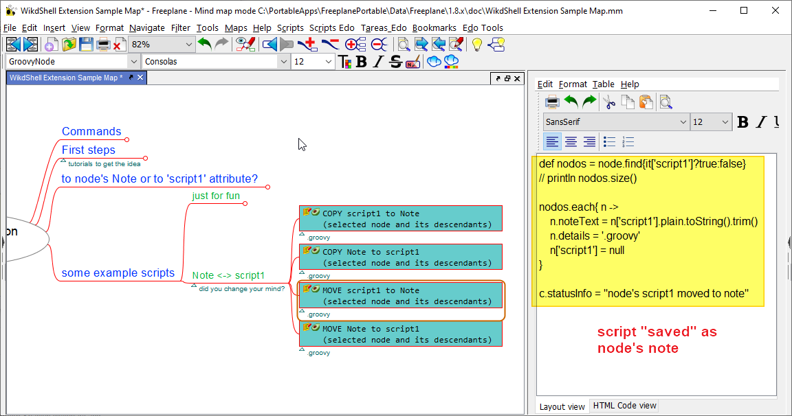
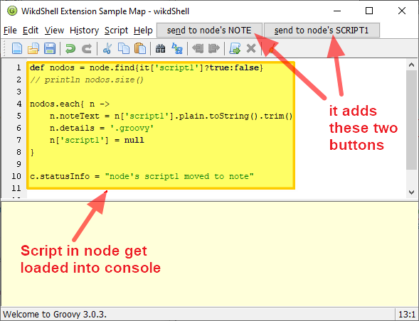
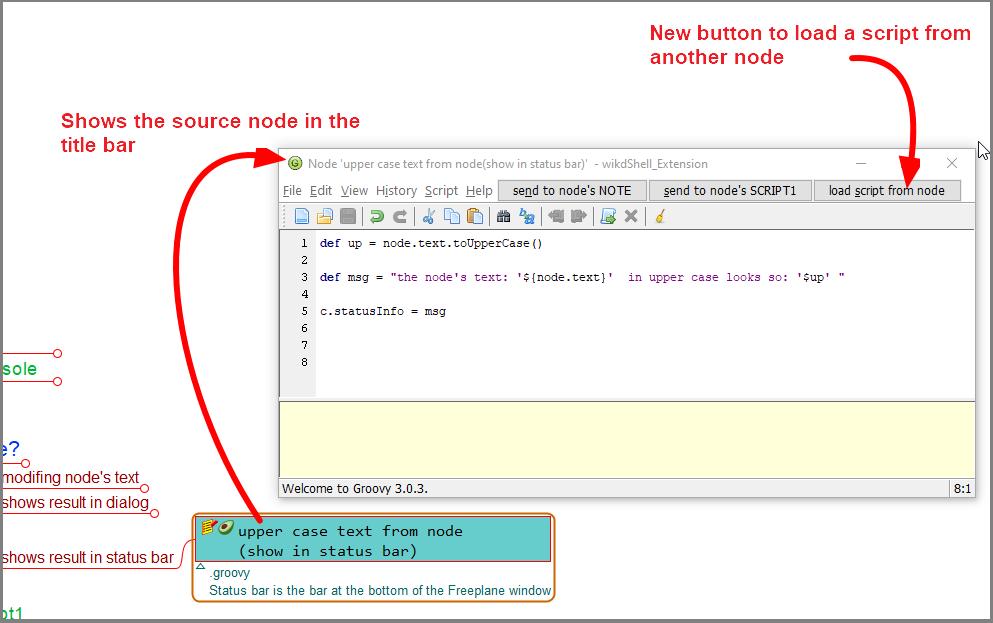
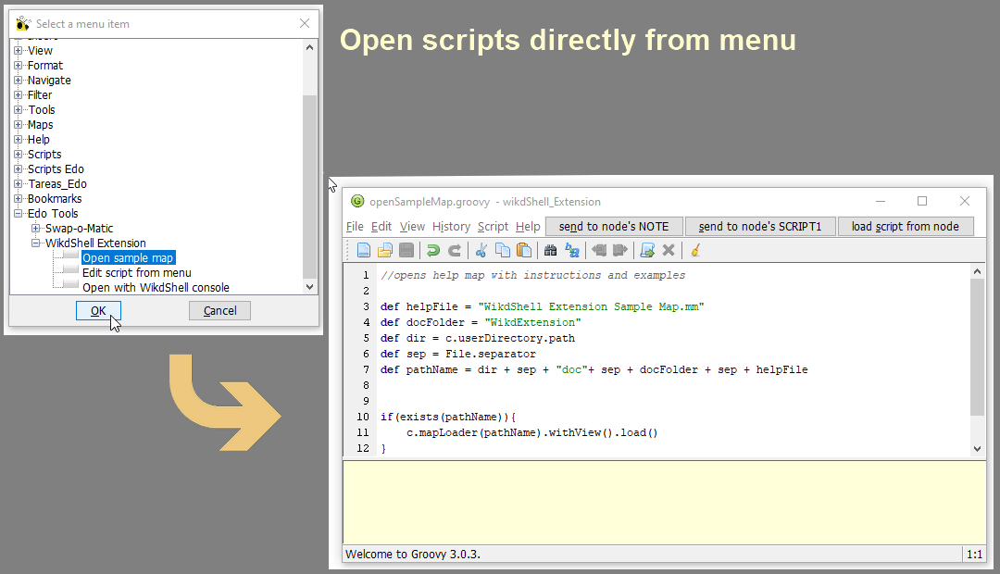
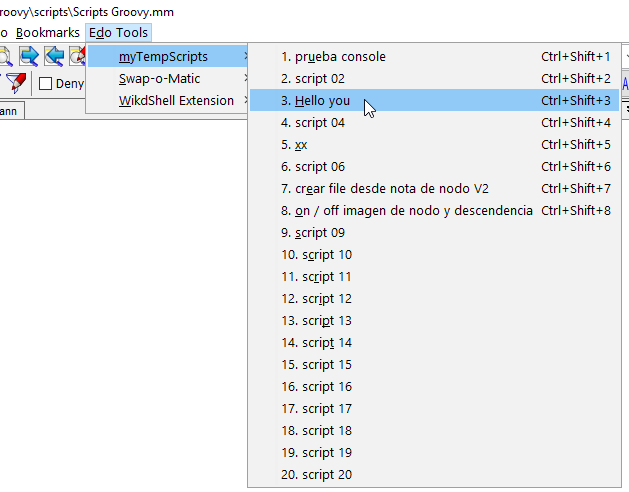
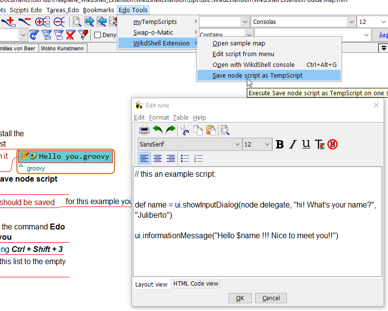
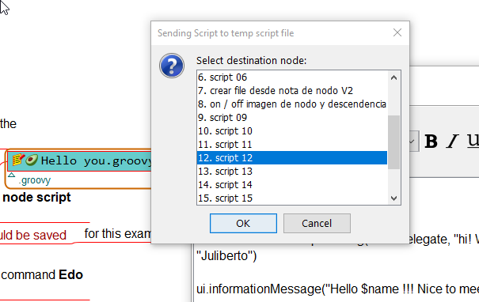

# Freeplane WikdShell_Extension Add On

**WikdShell_Extension** *add-on* for **[Freeplane](https://www.freeplane.org/)** adds some functionalities to the original **[WikdShell](https://www.freeplane.org/wiki/index.php/Add-ons_(install)#wikdShell)** *add-on*.

The original **WikdShell** is a great add_on that gives the user the posibility to open a **Groovy console** directly from **Freeplane** to create, edit and try **scripts** that interact directly with the **mindmaps**.

This way you can **add functionalities** to Freeplane, **automatize** repetitive **tasks** and **improve** your **productivity** when using mindmaps.

The present Add-On (**WikdShell_Extension**) gives you the additional possibility to **"save" the scripts** you create **as nodes in your maps**.

This way you can save all little tests, one time scripts or map specific scripts in your own organized way, **without overflowing** your scripts folders or **Freeplane's scripts submenu**.

> [!IMPORTANT]
> for this script to work, you need a **Freeplane** version equal or newer than **v1.8.10**

## Install

1. Get the latest version from **Freeplane** from [here](https://sourceforge.net/projects/freeplane/) and install it
1. Download the latest version of the **WikdShell_Extension AddOn** from [here](https://github.com/EdoFro/Freeplane_WikdShell_Extension/releases/)
1. **Install it** (just open the addon map in Freeplane and follow the instructions)
1. Download the **myTempScripts AddOn** from [here](https://github.com/EdoFro/Freeplane_WikdShell_Extension/releases/)
1. **Install it** (just open the addon map in Freeplane and follow the instructions)
1. **Restart Freeplane**

(if needed, here is more information about [installing Add-ons in Freeplane](https://www.freeplane.org/wiki/index.php/Add-ons_(install)#Installing_an_add-on))

---

## Images

### scripts are stored in the map's nodes

### Changes in WikdShell Groovy console

### NEW in v0.0.2: Button to load from selected node

### NEW in v0.0.2: Choose scripts to edit from menu item

---

### NEW in v0.0.3: MyTempScripts

#### Menu with temporary Scripts where you can load your scripts to

#### you can select a node that has a script and save it to the myTempScripts menu

#### ... then you choose which slot you want to use to save the script into

---

## Using the Add On

---

### Open Sample Map

This command opens a **mind map with instructions** and examples to learn how to use this Add-On

> [!TIP]
> Look at this map to learn how to use this Add-On

---

### Open With WikdShell console

This command opens the wikdShell Groovy console adding this functionalities to it:

#### 1. it loads the script from node in the console

- if, when calling the command, the selected node has:
  - a **link** to a **groovy file**
  - a '**script1**' attribute
  - or a groovy script in its **note** (\*)
  
  then the groovy console opens with that script in its editing pane

> [!NOTE]
> (\*) to identify that the note in a node is meant to be opened in the WikdShell Groovy Console, we can "*mark*" the node as a "*groovy node*".  
> this can be done by any of these ways:  
>
> - node's **text** must **end** with "**.groovy**"
> - node's **details** must **begin** with "**.groovy**"
> - or by adding a node's **attribute** with key "**file_ext**" and value "**groovy**"

---

#### 2. option to save script to a node

- it adds two buttons to the groovy console to directly export the edited script to
  - the node's note (\*\*)
  - or the node's 'script1' attribute

> [!NOTE]
> (\*\*) in this case, the node gets "*marked*" as a "*groovy node*" **automatically** by the Add-On

---

#### 3. button to load a script from the selected node

- it adds a button to load the script from the selected node if it has
  - a **link** to a **groovy file**
  - a '**script1**' attribute
  - or a groovy script in its **note** (\*)

---

### Edit script from menu

This command opens a dialog showing all menu items. The user can use it to choose a menu item related to a script and its file will open in the groovy console.

---

### Save node script as TempScript

With this command you can "upload" a groovy script, that is stored in a node, as a script in the myTempScripts menu

> [!TIP]
> the myTempScriptMenu has 20 slots that you can populate with your personal scripts

This way you can

- use your script any time you want
- use your script with any map
- assign to your script a hot key combination

---

## Examples

### - Saving script in node's note

---

## history

### v0.0.3

1. Added MyTempScripts feature
1. Some parameters were included as preferences
1. New behavior to "**Load from Node**" Button:  
    now it gives the possibilty to append the script from node to the current script in editor pane
1. It recognizes if MyTempScripts Addon is installed and if FP has been restartet after its installation

### v0.0.2

1. New button in console to load the script related to the selected node
1. New command to open scripts related to menuItems in Freeplane UI menus using a SelectMenuItemDialog
1. Shows node in WikdShell title (node text from node where the actual script was loaded from (or saved to))
1. Shows an *  in title if the script has been modified and not saved (or exported to node) (as "dirty" indicator)
1. Reorganizing the code in separate files
1. Added translations in spanish and german
1. Added images for AddOn (based on original images)
1. Libs builded into JAR file
1. Added original wikdShell.jar file (now it is not necessary to have WikdShell installed)

### v0.0.1

1. Initial release

## more information

- more information about [Add-ons in Freeplane](https://www.freeplane.org/wiki/index.php/Add-ons_(install))
